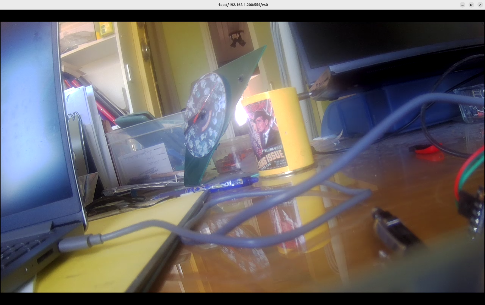

# Anyka AK3918 (JXF37) — local RTSP from source + WiFi + notes toward SD-free
 
Getting a **cloud IP camera** (Anyka **AK3918EV** SoC, **JXF37 / "jxfxx"**
sensor — this unit sold under **GNCC GC2**) to stream **local RTSP built from
source**, over WiFi, with correct orientation — no cloud, no app. Runs off an
SD card today; notes below on what blocks a fully SD-free (flash-only) setup.

This is a **companion / earlier-step** to the fuller ipcd + ONVIF PTZ + Frigate
project. RTSP-from-a-vendor-demo is the *easier first step* to prove the
camera streams and to nail down the exact libraries, sensor config, WiFi and
capture sequence — before investing in the full ipcd build.

> **Educational / reverse-engineering.** Raw flash, kernel modules,
> undocumented SDK libs. You can brick hardware. Only on cameras you own.
> Nothing here is redistributable that belongs to Anyka/the vendor — pull
> those libs/configs from your own device.

---

## Status

| Piece | State |
|---|---|
| Root shell (SD `wifitest` hook + telnet) | ✅ |
| WiFi up (RTL8188FU USB, correct load order) | ✅ |
| RTSP server streaming H.264 main+sub, port 554 | ✅ |
| Correct orientation (VI flip) | ✅ |
| Persistent across reboot **on SD card** | ✅ |
| Fully **SD-free** (flash only) | ❌ blocked on flash space — see docs/05 |

Help wanted: the SD-free step (fitting the extra libs into the tiny writable
flash, or a safe reflash of the `/usr` squashfs). See `docs/05`.

---

## Hardware

- **SoC:** Anyka AK3918EV (kernel 4.4.192, ARM926EJ-S, uClibc **0.9.33**)
- **Sensor:** JXF37 (`f22_probe_id id:0xf37`), MIPI 1-lane
- **WiFi:** Realtek **RTL8188FU** USB (`atbm`? no — this unit is 8188fu),
  MAC 60:1d:9d:…; needs the USB-host OTG controller up first
- **Flash (SPI NOR) partitions:**

```
mtd0 UBOOT  mtd1 ENV  mtd2 ENVBK  mtd3 DTB
mtd4 KERNEL mtd5 ROOTFS(/etc/jffs2 rw, tiny)  mtd6 /usr(squashfs ro, full)
mtd7 APP
```

- **Boot:** U-Boot `bootm ${loadaddr}=0x80008000 - ${fdtcontroladdr}`,
  console `ttySAK0,115200`. Stock `rcS`→`rc.local`→`service.sh` runs
  `/mnt/wifitest/wifi_test.sh` if `/mnt/wifitest` exists (the SD hook).

---

## The short version of what was hard

1. **WiFi wouldn't come up.** The RTL8188FU is a **USB** device; nothing
   enumerates until the **OTG USB-host controller** is loaded. Correct order
   (from stock `wifi_driver.sh`):
   `insmod sdio_wifi.ko` → `insmod otg-hs.ko` → `insmod 8188fu.ko`. Skip
   `otg-hs.ko` and `/sys/bus/usb/devices/` stays empty, no `wlan0`.
2. **uClibc mismatch.** The camera is uClibc **0.9.33** (loader
   `ld-uClibc.so.0`). Build the demo with an **arm-anykav200** (or v500)
   toolchain that targets `.so.0`; a uClibc-ng toolchain makes `.so.1`
   binaries/libs that fail with `can't load library 'ld-uClibc.so.1'`. Keep
   the whole library set `.so.0`-consistent (don't mix `.so.1` libs into
   `LD_LIBRARY_PATH`).
3. **Sensor config version.** `ak_vi_match_sensor` rejects an old config
   (`main_version_int=0x4`, "old version"). The one that works on this unit
   is `/etc/jffs2/isp_f37_mipi1lane.conf` **version 4.005**.
4. **ION/pmem leak.** A crashed run doesn't free the 28 MB ION reservation, so
   the next run fails `ION_IOC_ALLOC … errno=22`. **Reboot** to clear it, then
   run once.
5. **The capture-on segfault — the big one.** The vendor demo opens VI and
   prints "start capture" but **never calls `ak_vi_capture_on()`**, so
   `ak_vi_get_frame` loops on *"must call after capture on"* → no frames.
   Adding `ak_vi_capture_on(handle)` then **segfaults** — because
   `vi_set_capture_on()` dereferences `pdev->chn_main->max_width`, and
   `chn_main`/`chn_sub` are **NULL until `ak_vi_set_channel_attr()` is
   called** (that's where they're `calloc`'d — confirmed in `ak_vi.c`). Fix:
   call `ak_vi_set_channel_attr()` **before** `ak_vi_capture_on()`. Then
   frames flow and RTSP streams. (See `docs/03`, and `src/` for the patch.)
6. **Upside-down image.** `ak_vi_set_flip_mirror(handle, 1, 1)` (180°) — but
   it must be called on the **fully-initialised handle** *after* `vi_init`
   returns, not mid-init (mid-init it crashes).
7. **SD-free blocked on space.** 16 of the 20 needed libs are already in the
   read-only `/usr/lib`; only 4 are "extra" (`libakae` 462 KB,
   `libplat_common_one` 27 KB, `libplat_mem` 25 KB, `libplat_osal` 38 KB).
   The writable jffs2 has only ~212 KB free and `/usr` is a full read-only
   squashfs — so `libakae` (audio) doesn't fit. Video-only (drop `libakae`)
   would fit; or reflash `/usr`. Open problem — see `docs/05`.

---

## Repo contents

```
src/
  capture_on_and_flip.patch  the ak_rtsp_demo.c changes (channel-attr +
                             capture_on + flip), with context
  build.sh                   cross-compile recipe (arm-anykav200, .so.0)
scripts/
  wifi_up.sh                 correct WiFi load order (sdio_wifi→otg-hs→8188fu)
                             + wpa + dhcp/static
  run_rtsp.sh                LD_LIBRARY_PATH + cmd_serverd + start the demo
docs/
  01-shell-and-wifi.md       root shell, the USB-host WiFi ordering
  02-libraries-and-uclibc.md the .so.0 vs .so.1 trap, the 20-lib set
  03-capture-on-bug.md       the ak_vi.c NULL-deref, from source
  04-config-and-orientation.md sensor cfg version, VI flip placement
  05-toward-sd-free.md       the flash-space wall + ideas (help wanted)
```

---
## Credits / related (this work stands on theirs)

This project is built directly on the groundwork of three excellent
repositories — please credit/star them:

- **TECKIN-TC100 / Anyka AK3918 camera hacks** — ThatUsernameAlreadyExist:
  the `wifitest` SD boot-hook method (root shell without flashing, fully
  reversible). This is what makes everything here safe to try.
  <https://github.com/ThatUsernameAlreadyExist/TECKIN-TC100-Anyka-AK3918-camera-hacks>
- **GNCC GC2 ak3918ev300 RTSP** — piotr-go: the `usbnet` / password approach
  and RTSP groundwork on the very close GC2 (ak3918ev300).
  <https://github.com/piotr-go/GNCC_GC2_ak3918ev300_RTSP>
- **Anyka Camera Firmware** — MuhammedKalkan: the `ak_rtsp_demo` this build's
  demo is inspired by / derived from.
  <https://github.com/MuhammedKalkan/Anyka-Camera-Firmware>

Also related:
- **ipcd** — the fuller open camera app (ONVIF/PTZ):
  <https://github.com/medevil84/ipcd>

The vendor **`ak_rtsp_demo`** sources, Anyka SDK libs/headers, stock firmware
and sensor configs are the vendor's — extract from your own device, do not
redistribute.


## License

MIT for the docs and the glue scripts / patch here. Vendor SDK libs, the
`ak_rtsp_demo` sources, stock firmware and configs are **not** covered and
must come from your own device.
